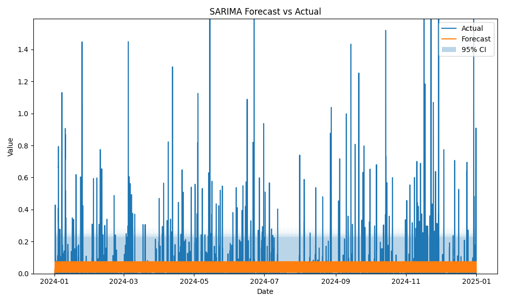
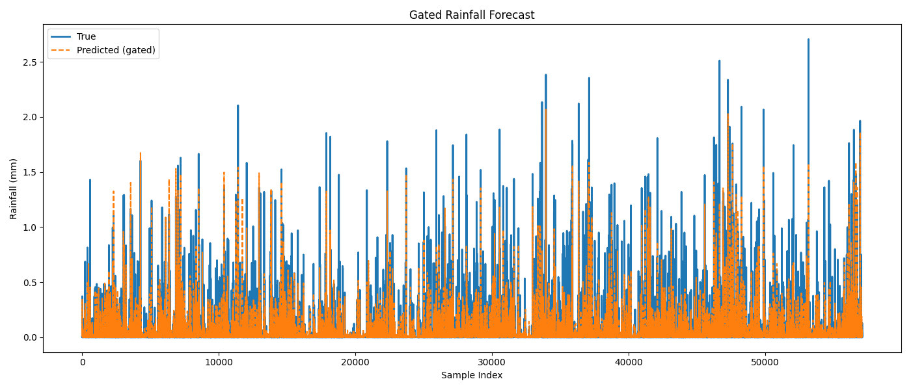
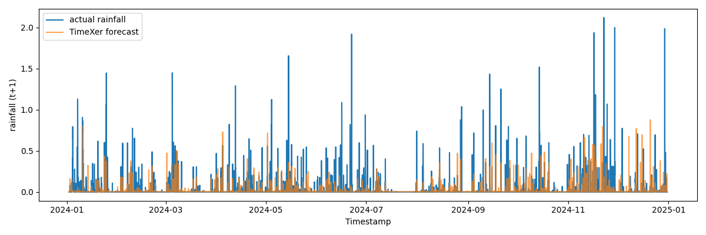
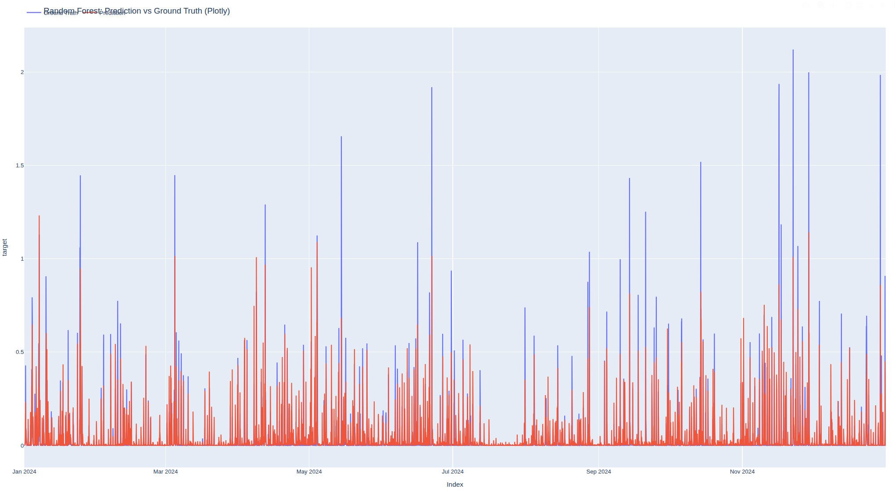
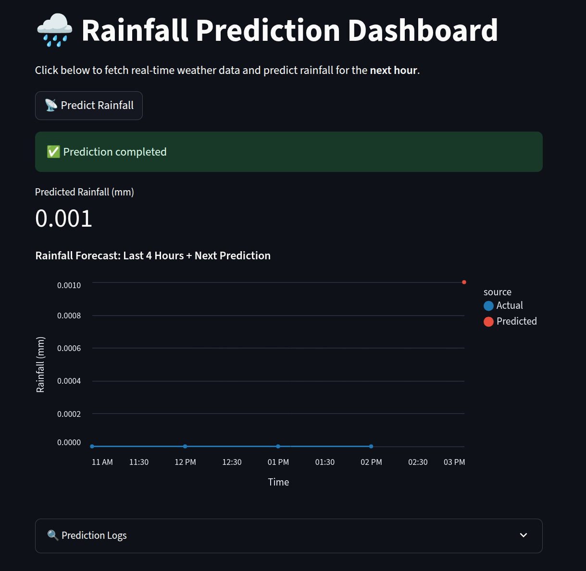

# RainCast: A Hybrid Pipeline for Forecasting Singapore Weather

## Name / Email

**Author:** Brian Isaac Kam\
**Email:** [isaacbikjk@gmail.com](mailto\:isaacbikjk@gmail.com) 

## Project Overview & Folder Structure

This project aims to forecast Singapore's rainfall using both statistical (SARIMA) and machine learning (TLSTM, TimeXer, Random Forest) approaches. It includes complete pipelines for API ingestion, preprocessing, feature engineering, model training, MLflow logging, and deployment via FastAPI and Streamlit.

```
.
├── api/ # FastAPI backend service
├── conf/ # Hydra config files
├── frontend/ # Streamlit UI frontend
├── images/ # Forecast screenshots and diagrams
├── logs/ # Log files for training/debugging
├── src/ # Source code for data, training, inference
├── tests/ # Unit tests
├── Containerfile-fastapi # Dockerfile for backend API
├── Containerfile-streamlit # Dockerfile for frontend UI
├── weather-app-compose.yml # Podman Compose deployment file
├── pyproject.toml # Python project settings
├── uv.lock # Dependency lock file
├── README.md # Project documentation
├── eda.ipynb # Exploratory analysis notebook
└── run.sh # Script to launch training
```

## Setup & Execution Instructions

### Installation

```bash
uv venv
uv sync --group dev --group data --group training --group inference
```

### Run Pipeline

```bash
python src/train.py
```

### Configuration

All model and training settings are defined in `conf/config.yaml`. Below is a breakdown of the key sections and how to customise them:

#### General Settings
```yaml
forecast_model: "SARIMA"       # Options: "SARIMA", "TLSTM", "TimeXer", "RandomForest"
epochs: 100                    # Number of training epochs (for ML-based models)
batch_size: 1024               # Batch size for model training
lookback_window: 24            # Number of past hours used for prediction
horizon: 1                     # Prediction horizon (how far into the future)
device: "cuda"                 # "cuda" for GPU, "cpu" for CPU
seed: 1111                     # Random seed for reproducibility
data_path: "./data/aggregated/"
```

#### Output & Logging
```yaml
model_checkpoint_dir_path: "./models"  # Directory to save trained models
log_dir: "./logs/models"               # Directory for training logs
resume: false                          # Whether to resume training from a checkpoint
```

#### MLflow Tracking (optional)
```yaml
setup_mlflow: true                     # Enable MLflow tracking
mlflow_autolog: false                  # Enable MLflow autologging
mlflow_tracking_uri: "https://mlflow.aiap19.aisingapore.net"
mlflow_exp_name: "isaacb_kam_jk_weather"
mlflow_run_name: "SARIMA"
```

### Model-Specific Settings

Each model has its own section under `conf/config.yaml`. Configure the appropriate section based on the model selected via `forecast_model`.

---

#### **TLSTM** (Time-Aware LSTM Ensemble)

```yaml
TLSTM:
  target_col: "rainfall"         # Variable to predict
  split_date: "2024-01-01"       # Train/validation split date
  hurdle: true                   # Use classification head for predicting rainfall occurrence
  delta: true                    # Include first-order difference features
  shuffle_train: false           # Disable shuffling for time-series consistency
```

#### **SARIMA**

```yaml
SARIMA: 
  pdq: [1,1,1]                     # Non-seasonal ARIMA parameters (p,d,q)
  seasonal_pdq: [1,1,0,24]         # Seasonal ARIMA parameters (P,D,Q,s)
```

#### **TimeXer**

```yaml
TimeXer:
  timestamp_col: "timestamp"                     # Time index column
  value_col: "reading_value_hourly_mean"         # Target aggregation method
  feature_cols:                                  # Explanatory variables
    - "wind_speed"
    - "air_temperature"
    - "wind_direction"
    - "humidity"
  target_col: "rainfall"
  window_size: 24
  prediction_length: 1
  split_date: "2024-01-01"                       # Train/val split
  num_workers: 2                                 # For data loading
  lr: 1e-4
```

#### **Random Forest**

```yaml
RandomForest:
  target_col: "rainfall"
  split_date: "2024-01-01"
  horizon: 1
  batch_size: 1024
  n_estimators: 100
  random_state: 42
  delta: true         
```


> No API key is required; uses Singapore's open weather API.

## Training Pipeline Logic / Flow

```
            ┌────────────────────┐
            │   API Collection   │ ←─── weather.gov.sg historical
            └────────────────────┘
                     ↓
         ┌───────────────────────┐
         │   Data Preprocessor   │ ──> missingness, MCAR test, causal imputation
         └───────────────────────┘
                  ↓
    ┌────────────────────────────────┐
    │ Feature Engineering (FE.py)    │ ──> lag features, delta, temporal OHE
    └────────────────────────────────┘
             ↓
 ┌─────────────────────────────────────────────────────────────────┐
 │ Model Selection (TLSTM / SARIMA / TimeXer / Random Forest)      │ → Training + MLflow logs  
 └─────────────────────────────────────────────────────────────────┘
             ↓
     ┌─────────────────────────────┐
     │  Evaluation + Plots         │ → static & interactive visualisation
     └─────────────────────────────┘
```

## EDA Summary & Impact

- Identified missing data patterns and addressed them using Little’s MCAR test and causal imputation.
- Strong seasonal trends (Nov–Jan monsoon) and hourly rainfall spikes (late afternoon).
- Differencing and ADF/KPSS tests were applied to ensure stationarity in SARIMA preprocessing.

## Feature Engineering Details

| Feature Type      | Description                                            |
| ----------------- | ------------------------------------------------------ |
| Lag Features      | Lookback windows (`t-1` to `t-24`) per forecast target |
| Elapsed Time      | Encodes irregular time gaps for TLSTM and TimeXer      |
| Delta Features    | First-order difference applied to continuous features  |
| Temporal Features | One-hot encoded month and hour values                  |
| Hurdle Label      | Binary indicator of rainfall occurrence (target > 0)   |

All features are causally imputed to prevent leakage.

## Model Choices & Rationale

| Model          | Justification                                                  |
| -------------- | -------------------------------------------------------------- |
| SARIMA         | Baseline model for seasonal time series                        |
| TLSTM-Ensemble | Combines regression and classification for rainfall detection  |
| TimeXer        | Transformer-based model effective for multivariate time series |
| Random Forest  | Simple, interpretable tree-based model suitable for tabular data |

## Evaluation Metrics & Results Comparison

| Model          | MAE  | RMSE | Accuracy (occurrence) |
| -------------- | ------ | ------ | ----------------- |
| SARIMA         | 0.0402 | 0.1151 | -                 |
| TLSTM-Ensemble | 0.0216 | 0.0682 | 83.76%            |
| TimeXer        | 0.0265 | 0.1055 | -                 |
| Random Forest  | 0.0264 | 0.0885 | -                 |

All metrics are evaluated on the holdout set from January 2024 onward. Forecast plots are saved to the `outputs/` directory.

## Model Forecasts Plots

**<u>SARIMA</u>**




**<u>TLSTM Ensemble</u>**




**<u>TimeXer</u>**



**<u>Random Forest</u>**



## Conclusion & Potential Improvements

**Conclusion:**

- **TLSTM-Ensemble** delivers the best overall performance, especially in capturing the sparse and irregular nature of Singapore's rainfall. It achieves the lowest RMSE and high classification accuracy. This model will be used for the real-time prediction pipeline.
- **SARIMA** serves as a solid statistical baseline but struggles to react to sudden spikes or variability, resulting in persistent underprediction.
- **TimeXer** performs well for multivariate temporal modelling and shows promising alignment with rainfall peaks, but slightly lags in predictive accuracy compared to TLSTM.
- **Random Forest** achieves respectable MAE and RMSE scores, particularly for short-horizon forecasts. However, it tends to overshoot rainfall peaks due to its lack of temporal awareness.

**Future Improvements:**

- Incorporate more real-time features like barometric pressure or cloud coverage if available through other APIs.
- Build a **streaming data ingestion + caching layer** to reduce repeated calls and improve latency.
- Extend forecasting from single-step to **multi-step** and **probabilistic forecasts** to better inform rainfall uncertainty.
- Use **model stacking or ensembling** to combine strengths of statistical and deep learning approaches.
- Apply **pretraining on unlabelled weather sequences** for TLSTM and TimeXer to boost generalisation under sparse data.

## Inference Pipeline Logic / Flow

```
            ┌───────────────────────────────┐
            │   API Collection              │ ←─── weather.gov.sg real-time
            └───────────────────────────────┘
                  ↓
    ┌───────────────────────────────────┐
    │ Feature Engineering (FE.py)       │ ──> lag features, delta, temporal OHE
    └───────────────────────────────────┘
             ↓
 ┌───────────────────────────────────┐
 │ Model Prediction (TLSTM)          │ 
 └───────────────────────────────────┘
             ↓
     ┌─────────────────────────────┐
     │  Dockerise and Compose      │ → streamlit frontend for prediction
     └─────────────────────────────┘
```

## Frontend & Backend Deployment Steps

Follow the steps below to containerize and deploy the FastAPI backend and Streamlit frontend using Podman:

---

#### Step 1: Build Docker Images

```bash
# Build FastAPI backend image
podman build -t fastapiservice -f Containerfile-fastapi

# Build Streamlit frontend image
podman build -t streamlitfrontend -f Containerfile-streamlit
```

#### Step 2: Create Shared Network

```bash
# Create a Podman network for communication between services
podman network create weather-app-network
```

#### Step 3: Launch the Application

```bash
# Start FastAPI and Streamlit containers in detached mode
podman-compose -f weather-app-compose.yml up -d

# Check running services
podman-compose -f weather-app-compose.yml ps
```
#### Step 4: Tear Down (Optional)

```bash
# Stop and remove containers, networks, and volumes
podman-compose -f weather-app-compose.yml down

# (Optional) Remove the custom network
podman network rm weather-app-network
```

> After launching, the Streamlit frontend will be available at `http://localhost:8501`. Predictions take approximately 10 mins.

> Future considerations to build a db for running data to prevent overhead from api calls.

#### Website Interface

